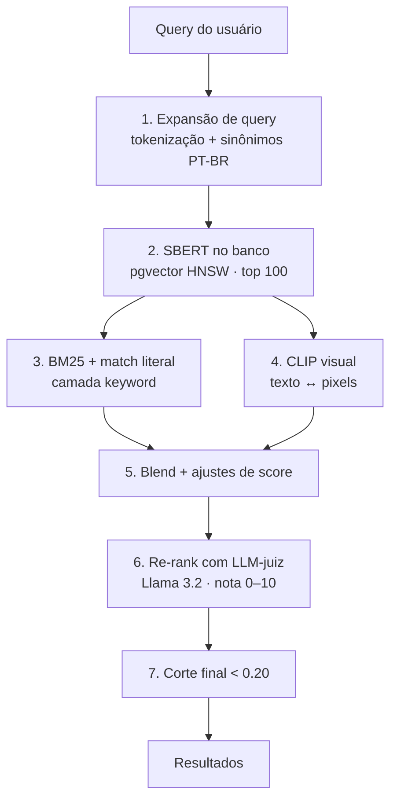

<div align="center">

# 🔍 Search+ — Relatório Completo do Projeto

**Busca semântica de arquivos locais com IA rodando 100% na sua máquina**


</div>

> **Repositório:** [github.com/itallolugon/SearchPlus_Prototipo](https://github.com/itallolugon/SearchPlus_Prototipo) · **Branch:** `main`
> **Data do relatório:** 2026-05-26 · **HEAD:** `fa92125` · **Total de commits:** ~33

---

## 📑 Índice

1. [O que é o Search+](#1-o-que-é-o-search)
2. [Stack técnico](#2-stack-técnico)
3. [Pipeline de busca semântica](#3-pipeline-de-busca-semântica)
4. [Anti-alucinação no LLaVA](#4-anti-alucinação-no-llava)
5. [Banco de dados — Supabase](#5-banco-de-dados--supabase)
6. [Endpoints da API](#6-endpoints-da-api)
7. [Análise heurística de Nielsen](#7-análise-heurística-de-nielsen)
8. [Segurança aplicada](#8-segurança-aplicada)
9. [Distribuição](#9-distribuição)
10. [Histórico de commits](#10-histórico-de-commits)
11. [Como rodar](#11-como-rodar)
12. [Experimentos que não deram certo](#12-experimentos-que-não-deram-certo)
13. [Pendências e próximos passos](#13-pendências-e-próximos-passos)
14. [Limitações conhecidas](#14-limitações-conhecidas)

---

## 1. O que é o Search+

Aplicativo de **busca semântica para arquivos locais** — imagens, PDFs, DOCX, TXT e CSV. O usuário aponta para uma pasta do PC e pesquisa em **linguagem natural** em vez de procurar por nome de arquivo:

> 🗣️ *"cachorro brincando"* · *"prato de comida com kebab"* · *"festa noturna"*

A IA de análise (descrição de imagens com **LLaVA** + embeddings semânticos com **SBERT**) roda **100% local** na máquina do usuário via Ollama. O banco de dados fica hospedado no **Supabase** (Postgres + pgvector), gratuito e na nuvem.

---

## 2. Stack técnico

### 🎨 Frontend — *vanilla, sem framework*

| Arquivo | Linhas | Descrição |
|---|---:|---|
| `index.html` | 706 | SPA completa: modais, painéis, ajuda |
| `script.js` | 1.886 | Lógica do app (toast, atalhos, busca) |
| `style.css` | 620 | Estilos (inclui toast e ajuda) |
| `fonts/` | — | BebasNeue, CoralPixels, MomoTrust |

### ⚙️ Backend — *Flask + Python 3.10+*

| Arquivo | Linhas | Descrição |
|---|---:|---|
| `backend/app.py` | 2.321 | API + worker de IA + arquivos estáticos |

### 🗄️ Banco de dados — *Postgres na nuvem*

- **Postgres no Supabase** (free tier, região São Paulo)
- Extensão **pgvector** ativa (vector similarity search nativa)
- Schema: `backend/schema.sql` (57 linhas)

### 🧠 Inteligência artificial — *toda local via Ollama*

| Modelo | Função | Detalhe |
|---|---|---|
| **LLaVA 13B** | Descrição de imagens | modo *deep* |
| **LLaVA latest (7B)** | Descrição de imagens | modo *fast* |
| **Llama 3.2** | Re-rank de busca | — |
| **SBERT MiniLM-L12** | Embeddings semânticos | 384 dim |
| **CLIP ViT-B-32** | Busca visual texto↔imagem | opcional, 512 dim |

> 📌 **Nota histórica:** o `qwen2.5vl` (7b e 3b) foi testado mas **revertido** — no hardware atual (RTX 4060 8GB) leva 7–12 min/imagem porque o llama.cpp ainda processa seu vision encoder na CPU. O LLaVA leva ~1 min/imagem.

---

## 3. Pipeline de busca semântica

> **Busca híbrida com 4 camadas + re-rank por LLM**



| # | Etapa | O que faz |
|---|---|---|
| 1 | **Expansão de query** | Tokenização, remoção de stopwords, expansão de sinônimos PT-BR (`cachorro → cao, dog, pet, filhote`). Cobre plural nasal (`homem ↔ homens`). |
| 2 | **SBERT no banco** | `ORDER BY embedding <=> %s LIMIT 100` — o Postgres usa o índice HNSW e devolve os 100 candidatos mais próximos, sem carregar embeddings na RAM. |
| 3 | **BM25 + match literal** | Sobre os 100 candidatos, score por palavra-chave (BM25) + match literal com variantes de plural. |
| 4 | **CLIP** *(opcional)* | Similaridade visual direta entre o texto da query e os pixels da imagem. |
| 5 | **Blend + ajustes** | Mistura os 3 scores com pesos. Regras: rejeição por gênero incompatível, boosts de match exato, threshold adaptativo (`0.35 → 0.30` quando vazio). |
| 6 | **Re-rank LLM-juiz** | Top-20 passa pelo Llama 3.2 que pontua relevância de 0–10. Salvaguarda contra o LLM "rejeitar" um hit forte do motor. |
| 7 | **Corte final** | Resultados abaixo de `0.20` são descartados. |

> ⚡ **Latência típica:** 300–500 ms por busca.

---

## 4. Anti-alucinação no LLaVA

- 🎯 `temperature=0.0`, `top_p=0.5` (reduz aleatoriedade)
- 🚫 Prompt explícito: *"NÃO INVENTE pessoas/animais que não estão visíveis"*
- 🐾 Campo **"Animais"** separado de **"Pessoas"**
- 📖 **Vocabulário canônico:**
  - `cachorro` (nunca *cão*/*cãe*)
  - `gato` (nunca *felino*/*bichano*)
  - `mulher`/`menina`/`homem`/`menino` (nunca *senhora*/*rapaz*/*cavalheiro*)

---

## 5. Banco de dados — Supabase

### Conexão

| Campo | Valor |
|---|---|
| **URL** | `https://pexxuyifyujvmshqtpuo.supabase.co` |
| **Região** | South America (São Paulo) |
| **Plano** | Free (500 MB DB, 50k usuários, sem cartão) |

### Estado atual *(snapshot 2026-05-26)*

| Tabela | Registros |
|---|---:|
| `users` | 4 |
| `folders` | 3 |
| `files` | 9 |
| `files` processados | 9 |
| **Tamanho do DB** | 10 MB |

### Esquema *(`backend/schema.sql`)*

**`users`**
```sql
id            SERIAL PRIMARY KEY
username      TEXT UNIQUE NOT NULL
password_hash TEXT NOT NULL         -- SHA-256 (ver pendência #1)
config_json   JSONB                 -- perfil, tema, cores, historico
```

**`folders`**
```sql
id                   SERIAL PRIMARY KEY
user_id              FK -> users(id) ON DELETE CASCADE
path                 TEXT
name                 TEXT
added_at             TIMESTAMPTZ
prioridades          JSONB    -- foco: pessoas/animais/paisagens/tudo
perfil_analise       TEXT     -- fast/deep
janela_processamento TEXT     -- always/02:00-06:00/customizado
UNIQUE (user_id, path)
```

**`files`**
```sql
id              SERIAL PRIMARY KEY
folder_id       FK -> folders(id) ON DELETE SET NULL
user_id         FK -> users(id) ON DELETE CASCADE
nome            TEXT
caminho         TEXT
tipo            TEXT
descricao_ia    TEXT
embedding       vector(384)   -- SBERT
embedding_clip  vector(512)   -- CLIP
data_adicionado TIMESTAMPTZ
favorito        INTEGER
processado      INTEGER
UNIQUE (user_id, caminho)
```

### Índices

| Índice | Tipo | Uso |
|---|---|---|
| `files_embedding_idx` | HNSW `vector_cosine_ops` | busca SBERT |
| `files_embedding_clip_idx` | HNSW `vector_cosine_ops` | busca CLIP |
| `files_user_processado_idx` | B-tree `(user_id, processado)` | filtro por usuário |
| `folders_user_idx` | B-tree `(user_id)` | pastas do usuário |

---

## 6. Endpoints da API

> **31 rotas** no total

<details open>
<summary><b>🔐 Autenticação</b></summary>

| Método | Rota | Descrição |
|---|---|---|
| `POST` | `/api/register` | Criar conta (auto-recria schema se faltar) |
| `POST` | `/api/cadastro` | Alias de `/register` |
| `POST` | `/api/login` | Login com sessão Flask |
| `POST` | `/api/logout` | Encerrar sessão |
| `GET` | `/api/check_session` | Verifica se ainda está logado |

</details>

<details>
<summary><b>⚙️ Configuração</b></summary>

| Método | Rota | Descrição |
|---|---|---|
| `GET` | `/api/config` | Lê perfil/tema/cores do usuário |
| `POST` | `/api/config` | Salva configurações |

</details>

<details>
<summary><b>📁 Pastas</b></summary>

| Método | Rota | Descrição |
|---|---|---|
| `GET` | `/api/folders` | Lista pastas monitoradas |
| `POST` | `/api/folders` | Adiciona pasta + dispara análise |
| `DELETE` | `/api/folders` | Remove pasta (cascata: apaga arquivos) |
| `DELETE` | `/api/folders/<id>` | Remove pasta por ID |
| `POST` | `/api/folders/update_config` | Atualiza prioridades/perfil/janela |

</details>

<details>
<summary><b>🔄 Análise / Indexação</b></summary>

| Método | Rota | Descrição |
|---|---|---|
| `POST` | `/api/analyze_folders` | Dispara scan de todas as pastas |
| `POST` | `/api/reanalyze` | Re-enfileira arquivos com descrição ruim |
| `POST` | `/api/reembed` | Regenera embeddings sem re-rodar LLaVA |
| `POST` | `/api/cancel_analysis` | 🆕 Esvazia a fila (cancelar indexação) |
| `GET` | `/api/status` | Status do worker (fila, processados) |
| `GET` | `/api/estimate_time` | Estima tempo de processamento |

</details>

<details>
<summary><b>🔍 Busca</b></summary>

| Método | Rota | Descrição |
|---|---|---|
| `GET`/`POST` | `/api/search` | Busca semântica com pgvector |
| `GET` | `/api/debug/scores` | Scores SBERT brutos (debug) |
| `GET` | `/api/debug/files` | Lista de arquivos indexados |

</details>

<details>
<summary><b>⭐ Favoritos / Histórico</b></summary>

| Método | Rota | Descrição |
|---|---|---|
| `GET` | `/api/favorites` | Lista favoritos |
| `POST` | `/api/favorites/toggle` | Marca/desmarca favorito |
| `GET` | `/api/search_history` | Histórico de buscas |
| `POST` | `/api/search_history` | Adiciona ao histórico |
| `DELETE` | `/api/search_history/<i>` | Remove item |
| `POST` | `/api/clear_history` | Limpa todo o histórico |
| `POST` | `/api/clear_cache` | Apaga arquivos indexados (mantém pastas) |

</details>

<details>
<summary><b>🪟 Diálogos do Windows · 🔧 Outros</b></summary>

| Método | Rota | Descrição |
|---|---|---|
| `GET` | `/api/choose_folder` | Abre dialog tkinter de pasta *(login)* |
| `GET` | `/api/choose_image` | Abre dialog tkinter de imagem *(login)* |
| `GET` | `/api/ollama_models` | Lista modelos Ollama disponíveis |
| `GET` | `/api/file/<path>` | Serve arquivo local (auth + path validation) |
| `GET` | `/api/open_location` | Abre Explorer com arquivo selecionado |

</details>

---

## 7. Análise heurística de Nielsen

Avaliação das **10 heurísticas clássicas de usabilidade** (Jakob Nielsen), com o estado **antes** da intervenção e o que foi implementado **depois**.

> **Legenda:** 🟢 bom · 🟡 médio · 🔴 fraco

<table>
<tr><th>#</th><th>Heurística</th><th>Antes</th><th>Status</th></tr>
<tr><td>1</td><td>Visibilidade do status do sistema</td><td>🟢</td><td>✅ melhorado</td></tr>
<tr><td>2</td><td>Correspondência sistema ↔ mundo real</td><td>🟢</td><td>— ok</td></tr>
<tr><td>3</td><td>Controle e liberdade do usuário</td><td>🟡</td><td>✅ implementado</td></tr>
<tr><td>4</td><td>Consistência e padrões</td><td>🟡</td><td>✅ implementado</td></tr>
<tr><td>5</td><td>Prevenção de erros</td><td>🟡</td><td>— parcial</td></tr>
<tr><td>6</td><td>Reconhecimento em vez de memorização</td><td>🟢</td><td>— ok</td></tr>
<tr><td>7</td><td>Flexibilidade e eficiência de uso</td><td>🟡</td><td>✅ implementado</td></tr>
<tr><td>8</td><td>Estética e design minimalista</td><td>🟢</td><td>— ok</td></tr>
<tr><td>9</td><td>Recuperar de erros <b>(ponto mais fraco)</b></td><td>🔴</td><td>✅ implementado</td></tr>
<tr><td>10</td><td>Ajuda e documentação</td><td>🔴</td><td>✅ implementado</td></tr>
</table>

### Detalhamento das correções

**H#1 — Visibilidade do status** *(🟢→melhorado)*
- Status bar reescrita: *"🔍 Analisando arquivos — N na fila"*
- Toast *"Análise concluída!"* quando a fila zera (transição N→0)
- Estados específicos: *"🕐 Aguardando janela"*, *"📂 Escaneando"*

**H#3 — Controle e liberdade** *(🟡→corrigido)*
- Endpoint `POST /api/cancel_analysis` (esvazia a fila)
- Botão *"✕ Cancelar análise"* na status bar quando há fila > 0
- Toast: *"Análise cancelada — N arquivos removidos"*

**H#4 — Consistência** *(🟡→corrigido)*
- Feedback unificado: **tudo via sistema de toast** (sucesso/erro/info/aviso)
- **Zero** `alert()` nativos restantes no código

**H#7 — Flexibilidade** *(🟡→corrigido)*
- `/` foca a barra de busca de qualquer lugar
- `Esc` fecha o modal/painel aberto mais relevante
- Atalhos documentados no modal de ajuda
- ⏳ *Pendente:* busca avançada (filtros por data, tamanho, pasta)

**H#9 — Recuperar de erros** *(🔴→corrigido — era o ponto mais fraco)*
- Sistema de toast unificado (`mostrarToast`)
- 4 tipos com ícone + cor + borda lateral, auto-dismiss + botão fechar
- **18** `alert()` nativos trocados por toast
- `console.error` silenciosos agora também disparam toast pro usuário
- Mensagens acionáveis:
  > ❌ *Antes:* "Erro de conexão com o banco de dados."
  > ✅ *Depois:* "Erro de conexão. Verifique se o servidor Python está rodando."

**H#10 — Ajuda e documentação** *(🔴→corrigido)*
- Botão *"?"* circular no header
- Modal de Ajuda com 6 seções: 🔍 Como buscar · 📁 Adicionar pastas · ⏳ Primeira análise · ⌨️ Atalhos · ⭐ Favoritos · ⚠️ Troubleshooting

### Tabela de severidade

| Severidade | Heurística | Status |
|---|---|:---:|
| 🔴 Alta | H#9 — Erros silenciosos pro usuário | ✅ |
| 🔴 Alta | H#10 — Sem ajuda dentro do app | ✅ |
| 🟡 Média | H#3 — Sem cancelar análise | ✅ |
| 🟡 Média | H#4 — `alert()` nativo (inconsistência) | ✅ |
| 🟡 Média | H#1 — Progresso pouco claro | ✅ |
| 🟢 Baixa | H#7 — Sem atalhos de teclado | ✅ |
| 🟡 Média | H#5 — Pouca validação de input | ⏳ pendente |
| 🟢 Baixa | H#7 — Sem busca avançada | ⏳ pendente |

> ✅ **Resultado:** 6 de 6 problemas críticos/médios identificados foram corrigidos. Os 2 itens pendentes são de baixa-média prioridade e ficam para evolução futura.
> Tudo implementado no commit `79e2518`.

---

## 8. Segurança aplicada

| ✅ | Item |
|:---:|---|
| ✅ | `/api/file/<path>` exige login + valida path dentro de pasta cadastrada (anti-path-traversal) |
| ✅ | `/api/choose_folder` e `/api/choose_image` exigem login |
| ✅ | XSS no histórico de buscas: `_escapeHtml()` antes de `innerHTML` |
| ✅ | XSS na status bar: `textContent` em vez de `innerHTML` |
| ✅ | `json.loads` sempre passa pelo wrapper `_safe_json_loads` |
| ✅ | Errorhandler global captura `UndefinedTable` e auto-recria schema |
| ✅ | Credenciais do Supabase em `backend/.env` (gitignored) |
| ✅ | Cookie de sessão `HTTPOnly`, `SameSite=Lax` |
| ✅ | Worker resiliente: fallback `"Imagem: x.jpg"` **não** marca como processado |

### ⚠️ Pendências de segurança *(para produção)*

- [ ] Trocar SHA-256 por **bcrypt/argon2** nas senhas *(5 min, mas crítico)*
- [ ] **Rotacionar** service_role key e senha do Supabase *(expostas no chat)*
- [ ] **HTTPS** no servidor (Flask só roda HTTP por padrão)

---

## 9. Distribuição

> *Em estudo*

O ZIP portátil + scripts `.bat` (`installer/`) testado anteriormente foi **removido**. Era frágil (depender de Ollama local pesa ~12 GB pro usuário final) e o caminho mais promissor é trocar a IA local por uma API.

**🔀 Decisão arquitetural pendente:**

| Opção | Vantagens | Tradeoffs |
|---|---|---|
| **Continuar 100% local** (Ollama) | privacidade total, sem custo por uso | 12 GB de download, `.exe` grande |
| **Migrar para IA via API** (Gemini/OpenAI/Anthropic) | `.exe` menor, qualidade superior | imagens saem do PC, custo por uso |

---

## 10. Histórico de commits

> Do mais novo ao mais antigo

```text
fa92125  revert: mantem LLaVA como modelo de visao (qwen2.5vl inviavel)
79e2518  feat: melhorias de usabilidade da analise heuristica de Nielsen
aff9614  feat: migra de SQLite local para Postgres no Supabase com pgvector
f47376b  fix: corrige 7 bugs encontrados na revisao de codigo
d405ff6  docs: README com instrucoes para usuarios leigos
ac8e202  feat: pacote portatil com instalador zipado
5035dbd  merge: integra UI do Lorenzo
74f0610  merge: integra backend do Lorenzo
64dc9ff  feat: integra backend do Lorenzo (perfis, janelas, novos endpoints)
c8e5517  feat: integra UI do Lorenzo (foco da análise, perfis, janelas)
e8c03fb  fix: api_register auto-recria schema se banco foi zerado
d3ad884  feat: re-rank com LLM, anti-alucinação no LLaVA e match morfológico
```

---

## 11. Como rodar

> **Fluxo diário**

```bash
# 1. Liga o PC
# 2. Inicia o Ollama (ícone na bandeja, roda em background)
# 3. No terminal, na pasta do projeto:
py backend/app.py
# 4. Abre no navegador:
#    http://127.0.0.1:5000
```

**📦 Pré-requisitos** *(uma vez só)*

- Python 3.10+
- Ollama instalado com `llava:13b` e `llama3.2` baixados
- `backend/.env` configurado com credenciais Supabase
- Conexão com internet *(o banco está na nuvem)*

---

## 12. Experimentos que não deram certo

### 🧪 Qwen 2.5 VL — *testado e revertido em 2026-05-22*

Tentativa de trocar o LLaVA pelo `qwen2.5vl` (7b depois 3b) buscando descrições mais precisas e modernas.

**Resultado dos testes** *(3 imagens, RTX 4060 8GB):*

| Modelo | Carregado | Tempo/imagem | Observação |
|---|---|---|---|
| `qwen2.5vl:7b` | 13 GB | 7+ min (CPU) | — |
| `qwen2.5vl:3b` | 6 GB | 7–12 min (CPU) | bug `GGML_ASSERT` em certas imagens |

> 🔬 **Causa raiz:** o vision encoder do Qwen 2.5 VL tem arquitetura nova que o llama.cpp/Ollama ainda processa na **CPU**, independente da VRAM livre. O LLaVA, mais antigo, é melhor otimizado.

> ✅ **Decisão:** mantido o LLaVA. Modelos qwen removidos do Ollama (liberou ~9 GB). Documentado para não repetir o experimento sem mudança de stack.

---

## 13. Pendências e próximos passos

### 🚀 Para produção real *(se algum dia)*

- [ ] Trocar SHA-256 por bcrypt/argon2 nas senhas
- [ ] Rotacionar credenciais do Supabase
- [ ] Adicionar HTTPS no servidor
- [ ] Migrar autenticação para Supabase Auth (JWT, recover, magic link)
- [ ] Subir o backend num servidor (atualmente é localhost)
- [ ] Logging estruturado (substituir `print`)
- [ ] Testes automatizados (pytest)

### 🎯 Para melhorar a busca *(sem trocar hardware)*

- [ ] Ligar o CLIP — baixar modelos uma vez com internet
- [ ] OCR em screenshots (PaddleOCR ou Tesseract)
- [ ] Pós-correção da descrição LLaVA com llama3.2 (canonizar termos)
- [ ] Storage de imagens no Supabase Storage (free 1 GB)
- [ ] Re-testar qwen2.5vl quando o Ollama otimizar vision encoders

### ✨ Para UX *(restante após análise heurística)*

- [ ] Indicador de "primeira indexação" mais explícito (*"Analisando 12 de 50"*)
- [ ] Salvar buscas como playlists/coleções
- [ ] Busca avançada (filtrar por data, tamanho, pasta)

---

## 14. Limitações conhecidas

- ⚠️ SBERT confunde *"gato"* e *"cachorro"* como semanticamente próximos (ambos pets); aparece como falso-positivo de score baixo (~0.30)
- 🪟 Diálogos nativos (tkinter) só funcionam no **Windows**
- 🌐 App só roda em **localhost** (não é multi-usuário em rede)
- 📡 **Sem internet = sem app** (depende do Supabase)
- ⏱️ LLaVA leva ~1 min/imagem na primeira indexação (modo deep com `llava:13b`)
- 🔁 Re-rank com LLM adiciona ~300 ms por busca (mas filtra muito ruído)
- 🖥️ Modelos de visão modernos (qwen2.5vl, llama3.2-vision) ainda não rodam bem nesta GPU pelo Ollama

---

<div align="center">

**— Fim do relatório —**

*Search+ · busca semântica com IA local*

</div>
