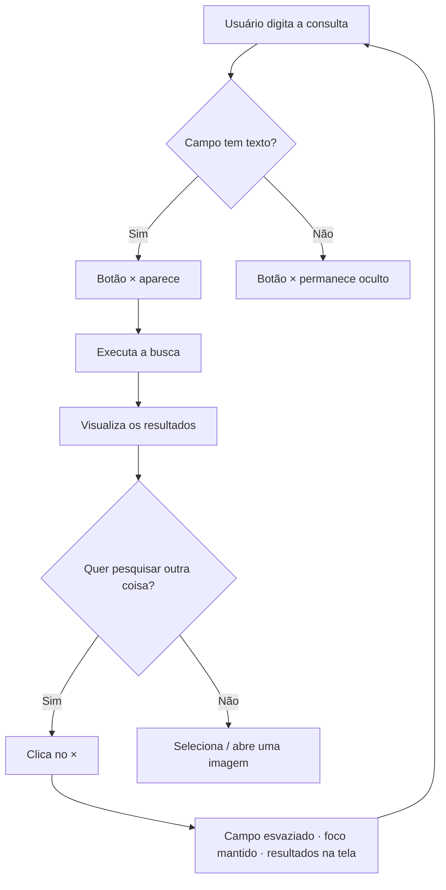

# Feature — Limpar rapidamente o campo de busca

**Data:** 25/08/2026
**Branch sugerida:** `feature/limpar-busca` (ver [`../07-git-fluxo.md`](../07-git-fluxo.md))
**Requisitos:** RF-001 … RF-012 · CA-001 … CA-007 ·
[`../09-requisitos-funcionais.md`](../09-requisitos-funcionais.md)
**Status:** especificação. Nenhum código de aplicação foi alterado.

---

## 1. Problema

Para trocar de pesquisa, o usuário precisa apagar o texto anterior à mão —
selecionar tudo (`Ctrl+A` ou arrastar) e depois `Backspace`/`Delete`. São três
ações antes de conseguir digitar a primeira letra da nova busca.

O Search+ é um app de **busca exploratória**: o usuário raramente acerta na
primeira tentativa. Ele refina — `"cachorro"` → `"cachorro na grama"` →
`"cachorro filhote"`. Cada refinamento paga esse pedágio. O custo é pequeno
isoladamente e alto no agregado, porque acontece dezenas de vezes por sessão.

Sintoma prático: em vez de refinar, o usuário tende a **encurtar** a nova
consulta para reaproveitar parte do texto — o que degrada a qualidade da busca
semântica, que funciona melhor com frases descritivas (`README.md`).

---

## 2. Objetivo

Reduzir "limpar e pesquisar de novo" de **3 ações para 1**, sem alterar o
comportamento de nenhum outro controle da barra de busca.

Fluxo pretendido:

```
Pesquisar → ver resultado → clicar no × → nova pesquisa → clicar no × → ...
```

---

## 3. Comportamento atual (verificado no código)

A barra de busca vive em `index.html:285-289`:

```html
<div class="search-box">
    <input type="text" id="searchInput" placeholder="Pesquise o que você lembra..."
           onkeypress="verificarEnter(event)"
           onfocus="mostrarHistorico()"
           onblur="setTimeout(esconderHistorico,150)">
    <button class="search-btn-img" onclick="abrirBuscaImagem()" title="Buscar por imagem">📷</button>
    <button class="gradient-btn search-btn" onclick="realizarBusca()">Buscar</button>
</div>
```

`style.css:317-319`:

```css
.search-box { display: flex; justify-content: center; width: 100%; max-width: 800px; margin: 0 auto; gap: 15px; }
.search-box input { flex: 1; padding: 25px 30px; border-radius: 30px; /* … */ }
.search-box input:focus { border-color: var(--accent-primary); }
```

O que já existe hoje relacionado a limpar o campo:

| Onde | O que faz | Observação |
|---|---|---|
| `voltarParaHomeSmooth()` — `script.js:1403` | Limpa o campo **e** volta para a home | Acionado pelo clique no logo (`index.html:281`) |
| `limparBusca()` — `script.js:2050` | Limpa o campo e esconde as telas | Usado no logout; comentado no código como "função placeholder" |
| `usarHistorico()` — `script.js:1333` | **Preenche** o campo com um item do histórico | Também precisa atualizar a visibilidade do botão |
| Atalho `/` — `script.js:2388` | Foca o campo | Não limpa |
| Atalho configurável (`Ctrl+Shift+F`) — `script.js:1223` | Foca **e seleciona** o conteúdo | É o mais próximo de "limpar" que existe hoje |

Nenhum desses é um botão visível dentro do campo. O botão `×` que existe hoje
na tela é outro: `.history-item-remove` (`script.js:1310`), que remove um item
do histórico — não o texto digitado.

---

## 4. Comportamento desejado

```
┌─────────────────────────────────────────────┐
│ montanhas neve suíça                   [ × ]│   ← há texto: botão visível
└─────────────────────────────────────────────┘

                    ↓ clique / Enter no botão

┌─────────────────────────────────────────────┐
│ Pesquise o que você lembra...               │   ← vazio, botão oculto, foco no campo
└─────────────────────────────────────────────┘
```

Regras, em uma frase cada:

1. Há texto → botão visível. Campo vazio → botão oculto (RF-001, RF-002).
2. Acionar → campo vazio, foco no campo, nada mais acontece (RF-003, RF-004).
3. Sem recarga, sem navegação, sem busca disparada (RF-005).
4. Os resultados na tela **permanecem** (RF-006).

---

## 5. Decisões de projeto

### 5.1 Ocultar, não desabilitar

**Decisão:** com o campo vazio, o botão recebe `display: none`.

**Por quê:** o projeto não possui nenhum padrão visual de botão desabilitado —
não existe regra `:disabled` em `style.css`, e os poucos casos de botão
inativo trocam o texto e usam `btn.disabled = true` sem estilo próprio
(ex.: `salvarPerfil()`, `script.js:1233`). Em contrapartida, ocultar elementos
condicionalmente **é** o padrão dominante do app: `#filterBarContainer`,
`#colecaoConteudo`, `#filtrosAvancados`, `#searchHistoryDropdown` e o próprio
`#sideBadgeScore` são todos alternados por `style.display`.

Um botão `×` permanentemente visível e apagado também gera ruído numa barra
que já tem três controles concorrendo por atenção.

### 5.2 Botão próprio, não `type="search"`

**Decisão:** manter `type="text"` e adicionar um `<button>` próprio.

**Por quê:** trocar para `type="search"` faria o Chromium desenhar um `×`
nativo automaticamente — de graça, mas com três problemas: o Firefox não o
exibe da mesma forma, o pseudo-elemento `::-webkit-search-cancel-button` só é
estilizável no WebKit/Blink (e a barra tem visual fortemente customizado), e
não há como anexar `aria-label` a ele. Isso violaria RF-009 e RF-012.

### 5.3 Não limpar os resultados

**Decisão:** o `×` limpa apenas o texto (RF-006).

**Por quê:** o app já tem uma ação de "voltar ao início" — o clique no logo,
que executa `voltarParaHomeSmooth()`. Duplicar esse comportamento no `×` faria
o usuário perder os resultados que ainda está olhando enquanto formula a
próxima consulta. Limpar texto e limpar tela são intenções distintas.

### 5.4 Ícone

**Decisão:** o glifo `×` (`&times;`, U+00D7), coerente com
`.history-item-remove` (`script.js:1310`), `.colecao-item-remover`
(`script.js:2540`) e `.toast-fechar` (`script.js:69`) — todos já usam `×` ou
`&times;` para "remover/fechar" no projeto.

---

## 6. Fluxo do usuário



---

## 7. Requisitos funcionais desta feature

Definidos em [`../09-requisitos-funcionais.md` §1](../09-requisitos-funcionais.md).

| ID | Resumo |
|---|---|
| RF-001 | Exibir o botão quando houver texto |
| RF-002 | Ocultar o botão quando o campo estiver vazio |
| RF-003 | Limpar o campo ao acionar |
| RF-004 | Manter o foco no campo após limpar |
| RF-005 | Não recarregar, navegar nem buscar |
| RF-006 | Preservar os resultados exibidos |
| RF-007 | Acionável por teclado |
| RF-008 | Não interferir nos botões `📷` e `Buscar` |
| RF-009 | Comportamento consistente nos *breakpoints* |
| RF-010 | Sincronizar com as limpezas programáticas existentes |
| RF-011 | Não perder o clique para o fechamento do histórico |
| RF-012 | `aria-label` + `title` |

## 8. Requisitos não funcionais desta feature

| ID | Resumo |
|---|---|
| RNF-001 | Máximo de 2 ações para trocar de pesquisa |
| RNF-002 | Alvo de clique de 32 px (desktop) / 44 px (móvel) |
| RNF-003 | Sem deslocamento de layout ao aparecer/sumir |
| RNF-007 | Puramente local, ≤ 16 ms, zero requisições |
| RNF-008 | Sem perda de quadros durante a digitação |
| RNF-038 | `aria-label="Limpar busca"` |
| RNF-039 | Elemento `<button type="button">` |
| RNF-040 | Foco visível |

---

## 9. Critérios de aceite

CA-001 a CA-007, detalhados em
[`../09-requisitos-funcionais.md` §5](../09-requisitos-funcionais.md).

Resumo: limpeza imediata com foco preservado · botão aparece/some conforme o
conteúdo · sem recarga e sem chamada a `/api/search` · funciona por `Tab`+`Enter` ·
some junto quando `voltarParaHomeSmooth()` limpa o campo · o clique não se
perde com o dropdown de histórico aberto · não colide com os botões nos
*breakpoints*.

---

## 10. Casos de borda

| # | Situação | Comportamento esperado | Requisito |
|---|---|---|---|
| 1 | Campo contém apenas espaços (`"   "`) | O botão **aparece**. A visibilidade se baseia em `value.length`, não em `value.trim()`. Se apenas espaços não mostrassem o botão, não haveria como apagá-los com um clique — que é justamente o caso mais irritante. Note que `realizarBusca()` já usa `.trim()` e ignora a consulta (`script.js:1508`); são checagens com propósitos diferentes. | RF-001 |
| 2 | Dropdown de histórico aberto ao clicar no `×` | O `onblur` do input agenda `esconderHistorico()` com 150 ms de atraso (`index.html:286`). Como o botão fica **fora** do input, clicar nele dispara `blur`. Mitigação: tratar `mousedown` com `preventDefault()` para que o input não perca o foco, mantendo `click` para o acionamento por teclado. | RF-004, RF-011 |
| 3 | Campo preenchido por `usarHistorico()` (`script.js:1333`) | O botão precisa aparecer. Atribuir `.value` por código **não** dispara o evento `input` — a visibilidade tem de ser atualizada explicitamente em cada ponto de escrita programática. | RF-010 |
| 4 | `voltarParaHomeSmooth()` ou `limparBusca()` esvaziam o campo | Mesmo raciocínio do caso 3, na direção inversa: o botão precisa sumir. | RF-010 |
| 5 | Texto colado com o mouse (menu de contexto → Colar) | Deve exibir o botão. O evento `input` cobre colagem, arrastar-e-soltar e autocompletar; `keyup` **não** cobriria. Este é o motivo de a especificação exigir `input`. | RF-001 |
| 6 | Autofill do navegador | Alguns navegadores preenchem sem disparar `input`. Verificar a visibilidade também no evento `focus` do campo, como rede de segurança. | RF-001 |
| 7 | `.search-box` em coluna (`style.css:1077`, < 480 px) | Input e botões ocupam 100% da largura, empilhados. O `×` precisa estar posicionado em relação ao **input**, não à `.search-box` — caso contrário ele "cai" sobre o botão `Buscar`. É o que motiva o wrapper descrito em §11. | RF-008, RF-009 |
| 8 | Texto mais longo que a largura do campo | O botão fica sobreposto ao texto. O `padding-right` do input deve reservar o espaço do botão, de modo que o texto pare antes dele. | RF-008 |
| 9 | Clique repetido no `×` já com o campo vazio | Impossível por construção: com o campo vazio o botão está oculto (RF-002) e não recebe clique nem foco por `Tab`. |RF-002 |
| 10 | `Ctrl+Shift+F` (atalho configurável, `script.js:1223`) | Faz `focus()` + `select()`, sem alterar o valor. O botão deve continuar visível — o texto ainda está lá, apenas selecionado. | RF-001 |
| 11 | Botão acionado com o campo desfocado (via `Tab`) | Deve limpar e **devolver** o foco ao campo (RF-004), não deixá-lo no botão — que nesse instante deixa de existir na tela. | RF-004, RF-007 |
| 12 | Usuário limpa e clica em `Buscar` sem digitar nada | `realizarBusca()` já retorna cedo com `if (!query.trim()) return;` (`script.js:1496`). Nenhum comportamento novo é necessário. | RF-005 |

---

## 11. Impactos técnicos

> ### Leia antes: esta seção tem dois cenários
>
> O [`docs/FRONTEND.md`](../FRONTEND.md) declara `index.html`, `style.css` e
> `script.js` como **substituíveis** — há um trabalho em andamento de
> reescrever a camada visual contra a mesma API, com o backend intacto.
>
> Isso divide a especificação em duas metades com validades diferentes:
>
> | Parte | Vale para |
> |---|---|
> | §1 a §10 — problema, comportamento, decisões, fluxo, requisitos, critérios de aceite, casos de borda | **Qualquer interface.** São requisitos de produto, independentes de tecnologia. |
> | §11 — impacto técnico | **Só o protótipo atual.** Se a interface for reescrita, o wrapper de layout descrito abaixo deixa de fazer sentido — o problema simplesmente não existe numa barra de busca construída do zero. |
>
> **Se você está construindo o frontend novo:** implemente §1–§10 e ignore
> §11.2. Um campo de busca com botão de limpar é trivial quando se desenha o
> componente; o trabalho descrito aqui existe apenas porque o protótipo atual
> não tem onde ancorar o botão.
>
> **Se você está corrigindo o protótipo atual:** §11 é o plano.
>
> O restante desta seção assume o segundo caso.

### 11.1 Arquivos afetados

| Arquivo | Natureza da mudança | Risco |
|---|---|---|
| `index.html:285-289` | Envolver o `<input>` em um wrapper e inserir o `<button>` | **Médio** — mexe na estrutura flex da barra |
| `style.css:317-319` | Mover `flex: 1` do input para o wrapper; estilizar o botão | **Médio** — ver 11.2 |
| `style.css:1042-1044`, `style.css:1077-1078` | Ajustar as duas *media queries* que hoje referenciam `.search-box input` diretamente | **Médio** — se esquecidas, a barra quebra no mobile |
| `script.js` | Função de alternância + `oninput` + chamadas em `usarHistorico()`, `voltarParaHomeSmooth()`, `limparBusca()` | Baixo |

### 11.2 O ponto delicado: o layout da `.search-box`

Este é o único risco real da feature e precisa estar claro para quem
implementar.

Hoje `.search-box` é um *flex container* cujos **três filhos diretos** são o
input e os dois botões. O input recebe `flex: 1` e ocupa o espaço restante.
Não existe nenhum elemento posicionado (`position: relative`) ao redor do
input — logo, **não há como ancorar um botão absoluto dentro dele** sem
introduzir um.

Posicionar o `×` absolutamente em relação à própria `.search-box` seria
possível calculando o deslocamento a partir da direita (a largura dos dois
botões mais os `gap`), mas o resultado é frágil: qualquer mudança no texto do
botão `Buscar`, no `gap` de 15 px, ou o empilhamento em coluna abaixo de
480 px quebra o cálculo.

**Abordagem recomendada:** introduzir um wrapper apenas ao redor do input.

```
.search-box (flex, gap 15px)
├── .search-input-wrap   ← novo: position: relative; flex: 1;
│   ├── #searchInput     ← perde flex:1; ganha width:100% e padding-right
│   └── #btnLimparBusca  ← novo: position: absolute; right: …; top: 50%
├── .search-btn-img (📷)
└── .search-btn (Buscar)
```

Três consequências a tratar:

1. **`flex: 1` migra** do input para o wrapper. Sem isso, o campo colapsa.
2. As duas *media queries* citam `.search-box input` por seletor
   (`style.css:1043` e `style.css:1078`). Precisam ser revistas — em
   particular `style.css:1078`, que aplica `width: 100%` ao input e aos
   botões; o wrapper passa a precisar do mesmo tratamento.
3. O input ganha `padding-right` suficiente para o texto não passar por baixo
   do botão. O `padding` atual é `25px 30px` (`style.css:318`).

### 11.3 Detecção de mudança de valor

O gatilho correto é o evento **`input`**, não `keyup` nem `keypress`. `input`
cobre digitação, colagem, arrastar-e-soltar, autocompletar e o `×` nativo, se
o navegador porventura o exibir. O input já tem três *handlers* inline
(`onkeypress`, `onfocus`, `onblur`, `index.html:286`); o projeto usa handlers
inline como convenção, então adicionar `oninput` é consistente — embora
registrar via `addEventListener` no bloco `DOMContentLoaded` (`script.js:40`)
também esteja dentro do padrão do arquivo.

### 11.4 Pontos de escrita programática

Três funções alteram `#searchInput.value` sem passar por evento `input` e
precisam chamar a atualização de visibilidade (RF-010):

- `usarHistorico()` — `script.js:1334` (preenche)
- `voltarParaHomeSmooth()` — `script.js:1404` (esvazia)
- `limparBusca()` — `script.js:2051` (esvazia)

Sugestão: centralizar em uma função única (por exemplo
`definirTextoBusca(valor)`) que escreve o valor **e** ajusta o botão, e fazer
as três chamarem essa função. Evita que uma quarta escrita futura reintroduza
o bug.

### 11.5 O que esta feature **não** toca

- `realizarBusca()`, `/api/search` e o pipeline de busca.
- O histórico de buscas e seus endpoints.
- A busca por imagem (`abrirBuscaImagem()`).
- Qualquer coisa no backend. **Nenhuma alteração em `backend/app.py`.**
- O banco de dados. **Nenhuma migração.**

### 11.6 Regressões a verificar

1. Barra de busca em 1920 px, 1024 px, 768 px e 375 px.
2. Dropdown de histórico abrindo, fechando e sendo clicado.
3. Atalhos `/` e `Ctrl+Shift+F`.
4. Clique no logo (`voltarParaHomeSmooth`) e logout (`limparBusca`).
5. Botão `📷` e botão `Buscar` continuam clicáveis em toda a área.
6. Transição `layout-centered` → `layout-top` ao executar a primeira busca
   (`script.js:1508`).
