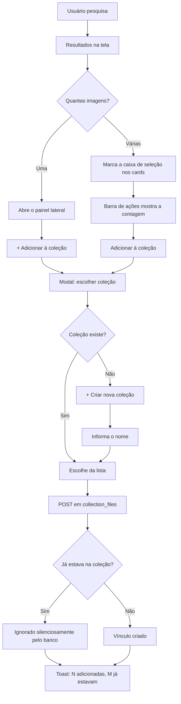
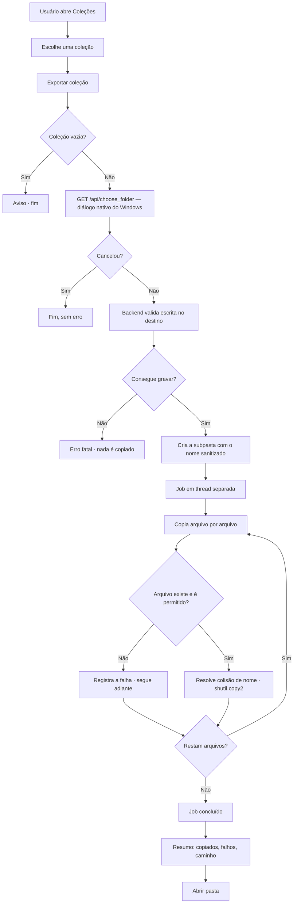

# Feature — Coleções e exportação para uma pasta local

**Data:** 25/08/2026
**Branch sugerida:** `feature/colecoes-exportacao` (ver [`../07-git-fluxo.md`](../07-git-fluxo.md))
**Requisitos:** RF-013 … RF-060 · CA-008 … CA-023 ·
[`../09-requisitos-funcionais.md`](../09-requisitos-funcionais.md)
**Status:** especificação. Nenhum código de aplicação foi alterado.

---

## 1. Problema

Uma coleção no Search+ hoje é uma organização **interna**: existe apenas dentro
do app, no Postgres. O usuário monta o agrupamento, olha, e não consegue
levá-lo para lugar nenhum. Para tirar as 12 fotos de "Arquitetura Moderna" do
app, ele precisa abrir cada uma no Explorer (`index.html:377`) e copiá-las à
mão, uma a uma, de pastas diferentes.

Há também uma lacuna anterior a essa: **não existe seleção múltipla**. Montar
uma coleção com 20 imagens exige abrir o painel lateral 20 vezes, porque
`abrirSeletorColecao()` opera sobre a global `_fileIdAtual`, definida em
`abrirPainelLateral()` (`script.js:1765`).

---

## 2. Objetivo

Transformar a coleção de agrupamento interno em **resultado material**: uma
pasta no computador do usuário, com os arquivos dentro, criada em uma ação.

E, no caminho, tornar viável montar uma coleção com muitas imagens.

---

## 3. Análise da arquitetura — o ponto crítico

O pedido original alertava, com razão, para não presumir que um frontend web
pode escrever em disco. A resposta para o Search+ é específica e favorável.

### 3.1 Que tipo de aplicação é o Search+?

**Aplicação web servida por um backend local.** Não é Electron, não é Tauri,
não é PWA, não é SPA com framework.

| Camada | O que é | Evidência |
|---|---|---|
| Frontend | `index.html` + `script.js` + `style.css`. HTML/CSS/JS puro, sem framework, sem *build step*. | `README.md`, ausência de `package.json` |
| Backend | Flask (Python) em `http://127.0.0.1:5000`, que **serve o próprio frontend** e expõe a API. | `backend/app.py:701`, `script.js:5` |
| Banco | Postgres + pgvector, hospedado no Supabase (nuvem). | `backend/schema.sql`, `backend/.env` |
| Inicialização | `rodar.bat` → `py backend/app.py` | `COMO_RODAR.txt` |

O detalhe decisivo: **o processo Python roda na máquina do usuário**. Ele tem
o mesmo acesso ao sistema de arquivos que o usuário logado no Windows. Duas
funcionalidades existentes já dependem disso e comprovam:

- `_tk_pick()` (`backend/app.py:1286`) abre um diálogo **nativo** do Windows
  via tkinter — só funciona porque servidor e usuário estão na mesma máquina.
- `/api/open_location` (`backend/app.py:3037`) executa
  `subprocess.Popen(["explorer", "/select,", filepath])` — abre o Explorer do
  usuário.

### 3.2 De onde vêm as imagens?

**São arquivos que já estão no disco do usuário.** Não são URLs, não são
blobs, não são objetos em bucket, não são cache.

O fluxo real:

1. O usuário cadastra pastas monitoradas (`POST /api/folders`,
   `backend/app.py:1026`), escolhidas pelo diálogo nativo.
2. `_scan_folder()` (`backend/app.py:3064`) percorre a pasta com `os.walk` e
   insere cada arquivo em `files`, guardando **o caminho absoluto** em
   `files.caminho`.
3. Um worker em segundo plano gera embeddings CLIP/SBERT e, sob demanda,
   descrições via Claude.
4. Para **exibir** a imagem, o frontend monta
   `http://127.0.0.1:5000/api/file/<caminho urlencoded>`
   (`formatImagePath()`, `script.js:152`). O endpoint lê o arquivo do disco com
   `send_file` e o devolve (`backend/app.py:1243`).

```
Disco do usuário  ──indexação──►  Postgres (metadados + vetores)
       │                                    │
       │◄────── send_file ──────── /api/file ◄── frontend pede a imagem
```

### 3.3 Consequência para a exportação

**Exportar = copiar arquivo local → pasta local.** Um `shutil.copy2` de A para
B, na mesma máquina. Não há download, não há rede, não há blob, não há
`URL.createObjectURL`, não há *File System Access API*.

Isso **elimina** três dos casos de erro previstos no pedido original:

| Caso previsto | Situação real |
|---|---|
| URL inválida | Não existe URL. O identificador é um caminho de disco. |
| Download falhou | Não há download. |
| Internet indisponível | A cópia é local. *(O app inteiro depende de internet para o banco no Supabase — mas isso afeta ler a lista da coleção, não copiar os arquivos.)* |

E **introduz** outros, que a especificação cobre em §8: arquivo movido desde a
indexação, permissão negada, disco cheio, colisão de nomes.

### 3.4 Alternativas descartadas

| Alternativa | Por que não |
|---|---|
| *File System Access API* (`showDirectoryPicker`) | Só Chromium; exige gesto do usuário; concede menos acesso do que o backend já tem. Seria um retrocesso técnico. |
| Baixar um `.zip` pela pasta de downloads | Não cria pasta; obriga o usuário a extrair; não atende ao pedido ("criar pasta no PC"). |
| Baixar arquivo a arquivo via `<a download>` | O navegador bloqueia downloads múltiplos; cai tudo em Downloads sem pasta; nomes colidem no comportamento do navegador. |
| Empacotar como Electron/Tauri | Reescrita de distribuição inteira para resolver algo que o backend local já resolve. |

**Conclusão: a arquitetura atual suporta a feature integralmente, sem nenhuma
dependência nova e sem mudança de schema.**

---

## 4. Conceito de coleção

Uma coleção é um **agrupamento nomeado de arquivos**, pertencente a um
usuário. Modelo já existente em `backend/schema.sql`:

```sql
CREATE TABLE collections (
    id        SERIAL PRIMARY KEY,
    user_id   INTEGER NOT NULL REFERENCES users(id) ON DELETE CASCADE,
    nome      TEXT NOT NULL,
    criado_em TIMESTAMPTZ NOT NULL DEFAULT NOW(),
    UNIQUE (user_id, nome)
);

CREATE TABLE collection_files (
    collection_id INTEGER NOT NULL REFERENCES collections(id) ON DELETE CASCADE,
    file_id       INTEGER NOT NULL REFERENCES files(id) ON DELETE CASCADE,
    adicionado_em TIMESTAMPTZ NOT NULL DEFAULT NOW(),
    PRIMARY KEY (collection_id, file_id)
);
```

Três propriedades que a especificação **herda** e não precisa reimplementar:

1. Nome único por usuário — `UNIQUE (user_id, nome)`.
2. Um arquivo não pode estar duas vezes na mesma coleção — a **PK composta**
   `(collection_id, file_id)` torna a duplicação impossível no banco.
3. Excluir uma coleção não apaga arquivos — o `CASCADE` só atinge
   `collection_files`, nunca `files`.

Uma coleção é um **rótulo**, não um contêiner: o arquivo continua onde está.
Só a exportação materializa uma cópia.

---

## 5. Favoritar ≠ selecionar

Esta é a distinção que a especificação precisa cravar, porque as duas ações
são visualmente próximas e semanticamente opostas.

| | ❤️ Favoritar | ☑ Selecionar |
|---|---|---|
| **Pergunta que responde** | "Gosto desta imagem." | "Quero esta imagem *nisto* que estou montando agora." |
| **Escopo** | A imagem, isoladamente | Uma operação em curso |
| **Duração** | Permanente, até desfavoritar | Efêmera — some ao recarregar a página |
| **Onde vive** | `files.favorito` (coluna no banco) | Memória do navegador. **Não** vai para o banco |
| **Quantidade** | Uma imagem, um estado | Muitas imagens, um conjunto |
| **Consequência** | Aparece em "Favoritos" | Habilita a barra de ações em lote |
| **Situação hoje** | ✅ Implementado | ❌ Não existe |

Favoritar é um **julgamento sobre a imagem**. Selecionar é um **passo de um
fluxo de trabalho**. Uma imagem pode ser favorita e não estar selecionada; pode
estar selecionada sem ser favorita; pode ser as duas coisas. Elas nunca se
influenciam (RF-014).

### 5.1 O que já existe de favoritos

- Coluna `files.favorito INTEGER DEFAULT 0` (`backend/schema.sql`)
- `GET /api/favorites` (`backend/app.py:2432`) e `POST /api/favorites/toggle`
  (`backend/app.py:2463`)
- Botão `.btn-fav-abs` no canto do card (`script.js:1699-1701`), coração
  branco quando não favoritado, classe `is-fav` quando favoritado
- Modal de favoritos (`abrirFavoritos()`, `script.js:1814`) e vitrine no
  dashboard (`carregarFavoritosDash()`, `script.js:1919`)

**Nada disso muda** (RF-015).

### 5.2 Como diferenciar na interface

Três eixos de diferenciação simultâneos — nenhum deles sozinho é suficiente:

| Eixo | Favoritar | Selecionar |
|---|---|---|
| Forma do ícone | Coração | Caixa de marcação quadrada |
| Posição no card | Canto **superior direito** (onde já está) | Canto **superior esquerdo** |
| Retorno visual | Coração preenchido | Borda/realce em **todo** o card + caixa marcada |

Depender só de cor viola RNF-042. A diferença de **forma** (coração redondo vs.
caixa quadrada) é o que sustenta a distinção para quem não distingue cores.

Ambos recebem `title` explicativo — "Favoritar" e "Selecionar para coleção" —
e o segundo deve expor estado programático (`aria-pressed` ou
`<input type="checkbox">`, RNF-041).

---

## 6. Fluxos

### 6.1 Da busca à coleção



O ramo esquerdo (uma imagem) **já existe** — `abrirSeletorColecao()`,
`criarColecaoEAdicionar()`, `adicionarAColecao()` (`script.js:2573-2636`).
O ramo direito (várias) é novo.

### 6.2 Da coleção à pasta



Em paralelo ao job, o frontend consulta o progresso a cada 300–500 ms e
atualiza a barra.

---

## 7. Especificação da exportação

### 7.1 Nomenclatura

**Rótulo adotado: "Exportar coleção".**

O pedido admitia "Criar pasta" como alternativa. "Exportar" é o termo correto
aqui porque a operação **copia** — "Criar pasta" sugere criar um contêiner
vazio, e o app já usa "pasta" com outro sentido bem estabelecido: *pasta
monitorada*, aquela que o usuário cadastra para o Search+ indexar
("Gerenciar Pastas", `index.html`). Chamar a saída da exportação de "pasta"
sem qualificação criaria ambiguidade direta com um conceito central do produto.

O botão "Abrir pasta", no resumo pós-exportação, é seguro: ali o referente já
foi estabelecido pela frase anterior.

### 7.2 Contrato sugerido da API

Segue as convenções vigentes: prefixo `/api/`, recurso em inglês no plural,
JSON com chaves em português, HTTP 401 sem sessão.

| Método e rota | Papel |
|---|---|
| `POST /api/collections/<id>/export` | Inicia o job. Corpo: `{"destino": "<caminho do choose_folder>"}`. Resposta: `{"status":"ok","job_id":"<uuid>","total":12,"pasta":"D:\\Fotos\\Natureza"}`. Erros fatais retornam 4xx **antes** de qualquer cópia. |
| `GET /api/collections/export/<job_id>` | Estado do job: `{"estado":"executando|concluido|cancelado|erro","copiados":8,"total":12,"falhas":[{"nome":"x.jpg","motivo":"nao_encontrado"}],"pasta":"..."}`. |
| `POST /api/collections/export/<job_id>/cancel` | Solicita cancelamento cooperativo. |
| `GET /api/open_folder?path=…` | Abre a pasta no Explorer. **Rota nova** — o `/api/open_location` existente usa `explorer /select,`, que seleciona um *arquivo*; abrir um diretório é `explorer <path>` ou `os.startfile(path)`. E a rota nova deve validar o caminho, coisa que a atual não faz (ver R-03). |

**Este contrato é uma proposta, não uma autorização.** O `AGENTS.md` do
repositório proíbe alterar `backend/` sem aprovação de quem o mantém — *"descreva
a proposta em vez de aplicá-la"*. É o que esta tabela faz.

Aceita a proposta, cada rota acima obriga **três** entregas em sincronia
(RF-061 a RF-064; verificado por `tests/integration/test_paridade_mock.py`):

1. A implementação real em `backend/app.py`.
2. A simulação em `backend/mock_server.py` — progresso e resumo realistas,
   **sem tocar o disco** de quem desenvolve o frontend, e com um meio de
   exercitar os caminhos de erro (exportação parcial, permissão negada,
   cancelamento).
3. A documentação em `docs/API.md`, seção "Coleções", no formato já usado ali.

O mesmo vale para a alteração em `POST /api/collections/<id>/files` (aceitar
`file_ids` em lote): muda nos três lugares ou não muda em nenhum.

### 7.3 Modelo do job

Segue o padrão de estado global que o backend já usa para a indexação —
`_status`, `_queue`, `_lock` com `threading.Lock` (`backend/app.py`):

```
_export_jobs: dict[str, dict]   # job_id → estado
_export_lock: threading.Lock
```

Cada job carrega: `user_id`, `collection_id`, `pasta_destino`, `total`,
`copiados`, `falhas[]`, `estado`, `cancelar: bool`.

Pontos obrigatórios:

- O job roda em `threading.Thread(daemon=True)`, como o worker de IA.
- O progresso vive **em memória**; nenhuma consulta ao banco por arquivo
  copiado (RNF-013).
- `_export_lock` protege toda leitura e escrita do dicionário.
- Um job por `(user_id, collection_id)` ao mesmo tempo (RF-057).
- O cancelamento é **cooperativo**: o laço checa a flag entre arquivos, jamais
  interrompe uma cópia em andamento (RF-056).
- Jobs concluídos são retidos por tempo limitado, para o frontend conseguir
  ler o resultado final antes de descartá-los.

### 7.4 Sanitização de nomes (RF-038 a RF-043)

Regras do Windows, mais restritivas que as do POSIX (RNF-031):

| Regra | Detalhe |
|---|---|
| Caracteres proibidos | `< > : " / \ \| ? *` e todos os controles `0x00`–`0x1F` |
| Fim do nome | Não pode terminar com `.` nem com espaço |
| Nomes reservados | `CON`, `PRN`, `AUX`, `NUL`, `COM1`–`COM9`, `LPT1`–`LPT9` — inclusive com extensão (`CON.jpg` é inválido) |
| Comprimento | O caminho completo deve caber em 260 caracteres (`MAX_PATH`), a menos que *long paths* esteja habilitado — o que não se pode assumir |
| Resultado vazio | Substituir por `colecao_<id>` (RF-039) |

Exemplo: a coleção `Férias 2024/2025: praia` vira `Férias 2024_2025_ praia`
(ou equivalente, conforme o caractere substituto escolhido — a decisão é livre,
desde que seja **determinística** e documentada na função).

A sanitização deve ficar em **uma única função pura**, testável sem tocar o
disco (RNF-036).

### 7.5 Colisão de nomes (RF-041, RF-042)

**Pasta de destino** — nunca escrever dentro de uma pasta que já existe:

```
D:\Fotos\Natureza        já existe
D:\Fotos\Natureza (1)    ← cria esta
```

**Arquivo dentro da pasta** — sufixo incremental, nunca sobrescrever:

```
IMG_0001.jpg
IMG_0001_1.jpg
IMG_0001_2.jpg
```

Colisão de nome de arquivo **é o caso comum, não a exceção**: `files` tem
`UNIQUE (user_id, caminho)`, não `UNIQUE (user_id, nome)`. Câmeras e celulares
produzem `IMG_0001.jpg` em toda pasta. Uma coleção montada a partir de várias
pastas monitoradas quase certamente terá nomes repetidos.

Nota de implementação: `os.path.exists` seguido de `copy2` tem uma janela de
corrida. Em uma pasta recém-criada por este mesmo processo o risco é baixo,
mas o padrão robusto é abrir o destino com `O_CREAT | O_EXCL` e tratar
`FileExistsError` incrementando o sufixo.

### 7.6 Duplicação (RF-047)

Duas noções distintas, frequentemente confundidas:

| Tipo | Situação | Tratamento |
|---|---|---|
| Mesma **entrada** duas vezes | O mesmo `files.id` adicionado duas vezes à coleção | **Impossível.** A PK composta impede. Nada a fazer. |
| Mesmo **conteúdo** em entradas distintas | `C:\A\foto.jpg` e `C:\B\foto.jpg`, bytes idênticos, `id` diferentes | Ambos são exportados, com nomes resolvidos por RF-042. |

O segundo caso **não** é deduplicado nesta versão. Deduplicar exigiria hash de
conteúdo, coluna que `files` não possui, e leitura completa de cada arquivo
antes da cópia. Fica registrado como decisão `D-4` em
[`../09-requisitos-funcionais.md` §7](../09-requisitos-funcionais.md).

---

## 8. Tratamento de erros

### 8.1 Classificação

Erros **fatais** abortam antes de qualquer cópia. Erros **por item** são
registrados e a exportação continua (RF-052).

| Situação | Tipo | Quando é detectada | Mensagem ao usuário |
|---|---|---|---|
| Coleção vazia | Fatal | Antes de abrir o diálogo | "Esta coleção está vazia. Adicione imagens antes de exportar." |
| Usuário cancelou o diálogo | Não é erro | No `choose_folder` | *(nenhuma — encerra em silêncio)* |
| Sem permissão de escrita no destino | Fatal | Teste de escrita antes de iniciar | "Não foi possível gravar em `D:\Fotos`. Escolha outra pasta ou verifique as permissões." |
| Não foi possível criar a pasta | Fatal | Ao criar o diretório | "Não foi possível criar a pasta da coleção em `D:\Fotos`. Escolha outra pasta." |
| Disco cheio (`ENOSPC`) | Fatal | Durante a cópia | "O disco ficou sem espaço. N imagens foram salvas antes de parar." |
| Arquivo não existe mais | Por item | Ao copiar | Consta no resumo: "não encontrada (movida ou apagada)" |
| Arquivo em uso / ACL nega leitura | Por item | Ao copiar | Consta no resumo: "sem permissão de leitura" |
| Caminho fora das pastas monitoradas | Por item | Na validação | Consta no resumo: "fora das pastas monitoradas" |
| Erro de leitura (setor defeituoso, rede caiu) | Por item | Ao copiar | Consta no resumo: "falha ao ler o arquivo" |
| Backend caiu no meio | Fatal | *Polling* do frontend | "A conexão com o Search+ foi perdida. Os arquivos já copiados estão em `…`." |
| Já existe exportação em curso | Fatal | Ao iniciar | "Esta coleção já está sendo exportada." |

### 8.2 Regras de redação

1. Dizer **o que aconteceu** e **o que fazer** (RNF-045).
2. Nunca exibir `traceback`, nome de exceção ou caminho interno do servidor
   (RF-055, RNF-046). O padrão `return jsonify({"mensagem": str(exc)})` usado
   em `/api/choose_folder` (`backend/app.py:1358`) **não** deve ser replicado.
3. Registrar o detalhe técnico no console do backend, sempre (RNF-047).
4. Usar o sistema de *toast* existente; nada de `alert()` (RNF-006).

### 8.3 Exportação parcial

O caso mais provável do mundo real, porque o índice envelhece: o usuário move
ou renomeia arquivos fora do app, e o banco não sabe.

```
✓ Coleção exportada — parcialmente

10 de 12 imagens salvas em
D:\Fotos\Natureza

2 não puderam ser copiadas:
  • praia_sunset.jpg — não encontrada (movida ou apagada)
  • familia_01.jpg  — não encontrada (movida ou apagada)

[ Abrir pasta ]
```

Listar **quais** falharam é requisito, não cortesia (RF-053): sem os nomes, o
usuário não tem como reconciliar a coleção com o disco.

---

## 9. Interface

Onde cada peça encaixa no que já existe.

> **Nota:** o [`docs/FRONTEND.md`](../FRONTEND.md) declara a camada visual
> (`index.html`, `script.js`, `style.css`) como substituível — há um plano de
> reescrever a interface contra a mesma API. Os requisitos e critérios de
> aceite desta feature valem para qualquer interface; as âncoras de código
> nesta seção descrevem **onde o comportamento vive hoje**, úteis tanto para
> alterar o protótipo quanto como referência do que a interface nova precisa
> reproduzir. O backend proposto em §7 independe dessa escolha.

### 9.1 Card de resultado

Construído em `buildCard()` (`script.js:1689-1705`). Hoje tem só o botão de
favorito absoluto. A caixa de seleção entra no canto oposto.

**Obstáculo técnico:** `renderizarResultados()` (`script.js:1666`) reconstrói
o grid inteiro com `mGrid.innerHTML = ordenados.map(buildCard).join('')`.
Qualquer estado de DOM é destruído a cada troca de filtro. A seleção precisa
viver em uma estrutura de dados (`Set` de `files.id`) da qual `buildCard()`
**lê** ao montar cada card — não no DOM (RF-019).

### 9.2 Barra de ações da seleção

Elemento novo, visível apenas com seleção não vazia:

```
┌──────────────────────────────────────────────────┐
│  5 imagens selecionadas    [+ Adicionar]  [Limpar] │
└──────────────────────────────────────────────────┘
```

O modal de escolha de coleção já existe (`#escolherColecaoModal`,
`abrirSeletorColecao()`, `script.js:2573`) — precisa aceitar uma **lista** de
`file_id`, não só a global `_fileIdAtual`.

### 9.3 Tela da coleção

`#colecaoConteudo` (`index.html:828-831`) hoje contém apenas
"← Voltar às coleções" e o grid. A ação de exportar entra ao lado do botão de
voltar. A tela é montada por `verColecao()` (`script.js:2502`), que já guarda
`_colecaoAtual = { id, nome }` — o contexto necessário já está disponível.

### 9.4 Progresso e resumo

```
Exportando "Natureza"...

██████████████░░░░░░  8 de 12

[ Cancelar ]
```

```
✓ Coleção exportada

12 imagens salvas em
D:\Fotos\Natureza

[ Abrir pasta ]        [ Fechar ]
```

O progresso precisa de `role="progressbar"` com `aria-valuenow`/`min`/`max`,
ou um `aria-live="polite"` com o texto `N de M` (RNF-043).

---

## 10. Critérios de aceite

CA-008 a CA-023, detalhados em
[`../09-requisitos-funcionais.md` §5](../09-requisitos-funcionais.md).

| ID | Verifica |
|---|---|
| CA-008 | Selecionar não favorita |
| CA-009 | Seleção sobrevive à troca de filtro |
| CA-010 | Nova busca zera a seleção |
| CA-011 | Adição em lote |
| CA-012 | Re-adicionar é idempotente |
| CA-013 | Remover da coleção não apaga o arquivo |
| CA-014 | Exportação bem-sucedida |
| CA-015 | Coleção vazia é bloqueada |
| CA-016 | Nome de coleção com caracteres inválidos |
| CA-017 | Pasta de destino já existente |
| CA-018 | Nomes de arquivo repetidos |
| CA-019 | Arquivo sumiu do disco → exportação parcial |
| CA-020 | Progresso monotônico e correto |
| CA-021 | Destino sem permissão |
| CA-022 | Cancelamento preserva o copiado |
| CA-023 | Abrir pasta |

---

## 11. Impactos na arquitetura

### 11.1 O que muda

| Camada | Mudança | Escala |
|---|---|---|
| `backend/schema.sql` | **Nenhuma.** Não há migração. | — |
| `backend/requirements.txt` | **Nenhuma.** `os`, `shutil`, `pathlib`, `threading`, `uuid` são biblioteca padrão. | — |
| `backend/app.py` | 4 rotas novas + módulo de job + função de sanitização — **mediante aprovação**, ver §7.2 | ~250 linhas |
| `backend/mock_server.py` | As mesmas 4 rotas, simuladas sem tocar o disco (RF-063) | ~80 linhas |
| `docs/API.md` | Documentar as rotas novas na seção "Coleções" (RF-062) | ~40 linhas |
| `tests/` | Testes unitários das rotas (401, validação, sanitização) no padrão de `tests/unit/test_endpoints_dados.py` | ~150 linhas |
| `index.html` | Barra de seleção, botão de exportar, modal de progresso | ~40 linhas |
| `script.js` | Estado de seleção, adição em lote, cliente de exportação com *polling* | ~200 linhas |
| `style.css` | Caixa de seleção, card selecionado, barra de ações, barra de progresso | ~80 linhas |

*(As três últimas linhas valem para o protótipo atual; numa interface
reescrita, o equivalente funcional — ver a nota em §9.)*

### 11.2 Componentes existentes impactados

| Componente | Impacto |
|---|---|
| `buildCard()` — `script.js:1689` | **Altera.** Ganha a caixa de seleção e passa a ler o estado de seleção. |
| `renderizarResultados()` — `script.js:1666` | **Altera.** Precisa preservar a seleção ao reconstruir o grid. |
| `abrirSeletorColecao()` — `script.js:2573` | **Altera.** Passa a aceitar lista de ids, não só `_fileIdAtual`. |
| `adicionarAColecao()` — `script.js:2633` | **Altera.** Vira operação em lote e reporta adicionados vs. já existentes. |
| `verColecao()` — `script.js:2502` | **Altera.** Ganha o botão de exportar. |
| `POST /api/collections/<id>/files` — `backend/app.py:2609` | **Altera.** Aceita `file_ids` (lista) e devolve a contagem real de inseridos. Manter `file_id` singular funcionando, para não quebrar o caminho atual. |
| `_tk_pick()` / `/api/choose_folder` — `backend/app.py:1286`, `1040` | **Reusa sem alterar.** |
| `toggleFavorito()` — `script.js:1869` | **Não toca.** |
| `/api/favorites*` | **Não toca.** |
| Pipeline de busca e indexação | **Não toca.** |

### 11.3 Riscos

| # | Risco | Gravidade | Mitigação |
|---|---|---|---|
| **R-01** | Exportação longa segurando uma thread do servidor de desenvolvimento do Flask, degradando a responsividade do app | Média | Job em thread daemon separada; nunca copiar dentro do *handler* HTTP (RF-048, RNF-011) |
| **R-02** | Caminhos em `files.caminho` desatualizados, gerando exportação parcial frequente | **Alta** — é o cenário mais provável no uso real | Tratamento por item robusto + relatório nominal das falhas (RF-052, RF-053) |
| **R-03** | Uma rota que abre caminhos no Explorer sem validação. **Já existe hoje:** `/api/open_location` (`backend/app.py:3037`) recebe `path` da query string e o passa direto ao `subprocess.Popen`, sem a checagem de pasta monitorada que `/api/file` faz (`backend/app.py:1263-1278`) | **Alta** (segurança) | A rota nova valida contra a lista de exportações da sessão (RF-059). Corrigir a rota existente é escopo separado, mas recomendado |
| **R-04** | Aceitar caminho de destino arbitrário no corpo da requisição transforma a API local em primitiva de escrita em disco | **Alta** (segurança) | Destino só vem do `choose_folder`; validar antes de gravar (RNF-016) |
| **R-05** | `_export_jobs` crescendo indefinidamente em memória | Baixa | Descartar jobs concluídos após janela de tempo |
| **R-06** | tkinter abrindo diálogo na máquina do **servidor** — inofensivo em `127.0.0.1`, quebrado se alguém expuser o Flask na rede | Média | Documentar que o Search+ é estritamente local; não é regressão, é premissa existente |
| **R-07** | O wrapper de layout da Feature 1 e os cards desta feature tocarem CSS próximo, gerando conflito de merge | Baixa | Branches separadas conforme [`../07-git-fluxo.md`](../07-git-fluxo.md); integrar `feature/limpar-busca` primeiro, que é bem menor |
| **R-08** | O N+1 em `GET /api/collections` (`backend/app.py:2508`) piorando conforme as coleções ficam mais usadas | Média | Já registrado como RNF-051; não é introduzido por esta feature, mas é agravado por ela |

### 11.4 Dependências técnicas

| Dependência | Status |
|---|---|
| Backend Python rodando na máquina do usuário | ✅ Já é a arquitetura |
| Sessão autenticada (`_uid()`) | ✅ Existe |
| Tabelas `collections` / `collection_files` | ✅ Existem |
| Diálogo nativo de pasta | ✅ `/api/choose_folder` |
| Padrão de job em background com estado global | ✅ Existe no worker de indexação |
| Padrão de *polling* no frontend | ✅ Existe (`buscarStatus`, `script.js:2323`) |
| `shutil`, `os`, `pathlib`, `threading`, `uuid` | ✅ Biblioteca padrão do Python |
| Servidor mock para desenvolver a UI sem infra | ✅ `backend/mock_server.py` — precisa ganhar as rotas novas (RF-061, RF-063) |
| Aprovação de quem mantém `backend/` | ⚠️ Obrigatória antes de implementar (`AGENTS.md`) |
| Migração de banco | ❌ Não é necessária |
| Biblioteca nova | ❌ Nenhuma |

---

## 12. Limitações da plataforma

Honestas e explícitas, para não virarem surpresa na implementação.

| # | Limitação | Consequência |
|---|---|---|
| **L-01** | **Somente Windows.** `explorer` e os diálogos tkinter são específicos de Windows. O `README.md` já declara Windows como requisito. | "Abrir pasta" deve ser omitido em outras plataformas, com o caminho exibido como texto (RF-060). O código específico de SO fica isolado (RNF-030). |
| **L-02** | **O servidor precisa estar na mesma máquina do usuário.** O diálogo tkinter abre onde o Python roda. | Não é regressão — é premissa de toda a arquitetura. Mas impede qualquer hospedagem remota do Search+ sem repensar essa camada. |
| **L-03** | **Não há acesso ao disco pelo navegador.** Toda operação de arquivo passa pelo backend. | Se o backend cair, a exportação para. O frontend precisa detectar e informar (RNF-026). |
| **L-04** | **O índice pode estar desatualizado.** `files.caminho` reflete o último *scan*; arquivos movidos fora do app não são detectados até a próxima varredura. | Exportação parcial é um resultado normal, não uma falha do sistema (R-02). |
| **L-05** | **`MAX_PATH` de 260 caracteres.** Vale para o caminho completo, não apenas para o nome. | Nome de coleção longo + destino profundo + nome de arquivo longo pode estourar. Daí RF-040. |
| **L-06** | **Não há transação sobre o sistema de arquivos.** Não existe *rollback* de cópia. | Cancelamento e falha fatal deixam os arquivos já copiados no lugar, por definição. É o comportamento correto — apagar seria destrutivo (RF-054, RNF-020). |
| **L-07** | **O banco é remoto (Supabase).** Listar a coleção depende de internet, ainda que a cópia seja local. | Sem internet, a exportação nem começa — falha ao ler `collection_files`, com mensagem adequada. |
| **L-08** | **O servidor de desenvolvimento do Flask não é um servidor de produção.** Concorrência limitada. | Um job de exportação por vez é uma restrição sensata, não apenas uma simplificação (RF-057). |
